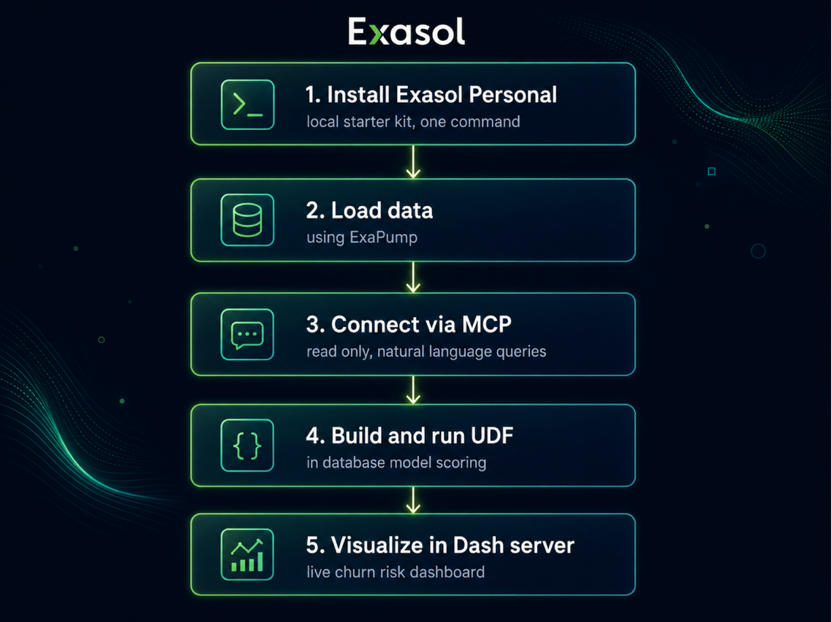

# Churn Prediction Demo — How We Built It, Step by Step

The goal was to show that Exasol can do more than store and query data. It can run
machine learning inside the database itself, connect to AI tools directly, and power a
live dashboard — all from a setup that runs entirely on a laptop. Here is how we put it
together, stage by stage.

## 1. Installing Exasol Personal (Local Starter Kit)

- We installed Exasol Personal, which is a free, fully functional version of Exasol
  meant for individual use on a local machine.
- The setup ran locally with a single install step, no cloud account or infrastructure
  needed.
- This gave us a real, production-grade database engine running entirely on a laptop,
  with no data or feature limits.
- Everything built afterward — the data, the model, and the dashboard — sits on top of
  this one local instance.

## 2. Loading Data Using ExaPump

- We used ExaPump to load our sample datasets into the local Exasol instance, including
  a real telecom customer dataset of about 7,000 records.
- This gave us properly structured tables inside Exasol, ready for querying, without
  needing to write custom load scripts.
- The dataset included details like customer tenure, monthly charges, contract type,
  and whether the customer had actually cancelled in the past.
- This became the foundation for everything downstream, from analytics to the machine
  learning model.

## 3. Connecting Through MCP with Read-Only Access

- We connected to the local Exasol instance using MCP, which let us query and explore
  the database directly through natural language, using an AI assistant.
- Access was configured as read-only, meaning the assistant could inspect schemas,
  tables, and run queries, but could not modify or delete anything in the database.
- This let us explore the data, check table structures, and run analytics queries
  conversationally, without needing to write raw SQL by hand every time.
- It also meant we could safely experiment and ask questions without any risk to the
  underlying data.

## 4. Building and Running the UDF

- We trained a small machine learning model outside the database, using a short Python
  script, based on the historical churn data (see `ml/train_model.py`).
- The trained model was saved as a single file and stored inside Exasol's own file
  storage, called BucketFS.
- We then created a UDF, short for user-defined function, which let us register custom
  Python code directly inside Exasol as if it were a native SQL function.
- Once created, this UDF could be called from a normal SQL query to score any
  customer's likelihood of churning, in real time, without any data ever leaving the
  database.
- We tested this by scoring all 7,000 customers in one query, and the results matched
  expectations: customers who were new, on a month-to-month contract, and paying more
  each month showed the highest risk.
- We then saved these scored results into a new table inside Exasol, ready to be used
  elsewhere.

## 5. Visualizing Results with Dash Server

- We used a locally running Dash server, a Python-based framework for building
  interactive dashboards, to visualize the results.
- The dashboard connected directly to the new results table inside Exasol and displayed
  key numbers at a glance: total customers, how many were flagged high risk, the
  average predicted risk, and the actual historical churn rate for comparison.
- We added a chart showing how risk was distributed across all customers, along with a
  table listing the highest-risk customers individually.
- The dashboard updates automatically whenever the underlying table is refreshed,
  giving a live, always-current view of churn risk.

## Summary

We installed Exasol Personal locally, loaded real customer data using ExaPump,
explored it safely through MCP with read-only access, trained and deployed a machine
learning model inside the database using a UDF, and visualized the results live through
a Dash dashboard.

Every step after the initial model training happened entirely within our own local
environment, with no external services or data transfers involved — which is the main
point worth highlighting when explaining why this approach matters.

## Repository contents

| File | Purpose |
|---|---|
| `RUNBOOK.md` | Full demo runbook — table-name reference, credential rotation fix, stage cold-start sequence |
| `sync-credential.sh` | Re-syncs dash-server's Exasol credential after any restart (the password rotates) |
| `refresh-table.sh` | Safely truncates and reloads a dashboard's table without breaking its name |
| `ml/train_model.py` | Trains the churn model (RandomForestClassifier on tenure, MonthlyCharges, Contract) |
| `ml/churn_model.pkl` | The trained model artifact, uploaded into Exasol's BucketFS for the UDF to load |
| `ml/WA_Fn-UseC_-Telco-Customer-Churn.csv` | The source telecom customer dataset (~7,000 rows) |
